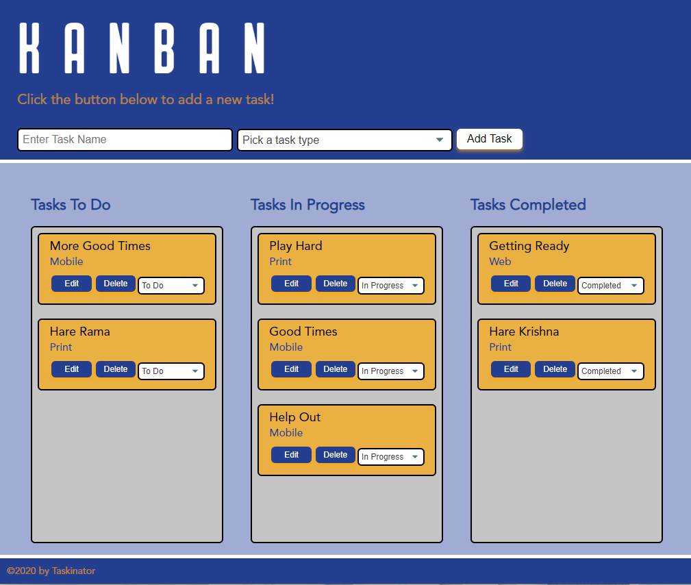
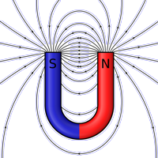

# <Your-Project-Title> Simple Task Manager
## KANBAN Board 
### [Installation](#installation)  - [Usage](#usage)  - [Credits](#credits)  - [License](#license) - [Features](#Features)
&nbsp;
## Description
  What began as a simple class project will hopefully beome the backbone of a vast empire spanning the galxay or at least will help me remeber to get milk and call my friend back.

The following is a short description of my experience on the project:

- I have been behind the eightball all week and had very little time to dive more deeply into the possibilities of this task manager.  Likewise, this README.md will be minimal.
- When I began I did not understand the relationship of the JavaScript to the HTML document.  Now that I understand the DOM is maintained by the browser like a kind of menu of all the things I an order from it's kitchen using JavaScript, I am even more excited to explore the possibilities.
- I wish I had more time to reinforce my learning.  Until now I have been able to spend a little time adding more CSS and HTML code of my own to my work in the course to really dial in the performance of my applications, but that will have to wait for now. (Jan 2022)

## Installation
Load the site in Chrome Browser for best performance and enjoy.
## Usage
Use this webpage to track your to do's and get more done.

See it online now at: [https://h0rsesh0e.github.io/kanbanTaskBoard/]

## Credits
This began as my fourth course module assignment in the Coding Boot Camp provided by [The School of Continuing Studies, University of Toronto](https://learn.utoronto.ca/) and [Trilogy Education Services](https://www.trilogyed.com/). 

## License
All content excluding typefaces, registered trade marks and the publicly licensed background image is the exclusive property of David Baron and or Tirlogy Education Services and or The School of Continuing Studies, University of Toronto.

## Features
  This task manager features simplicity and no extraneous functionality to confuse the users aprehension of the present state of their task completedness.

&nbsp;

&nbsp;

**H0RSESH0E**
